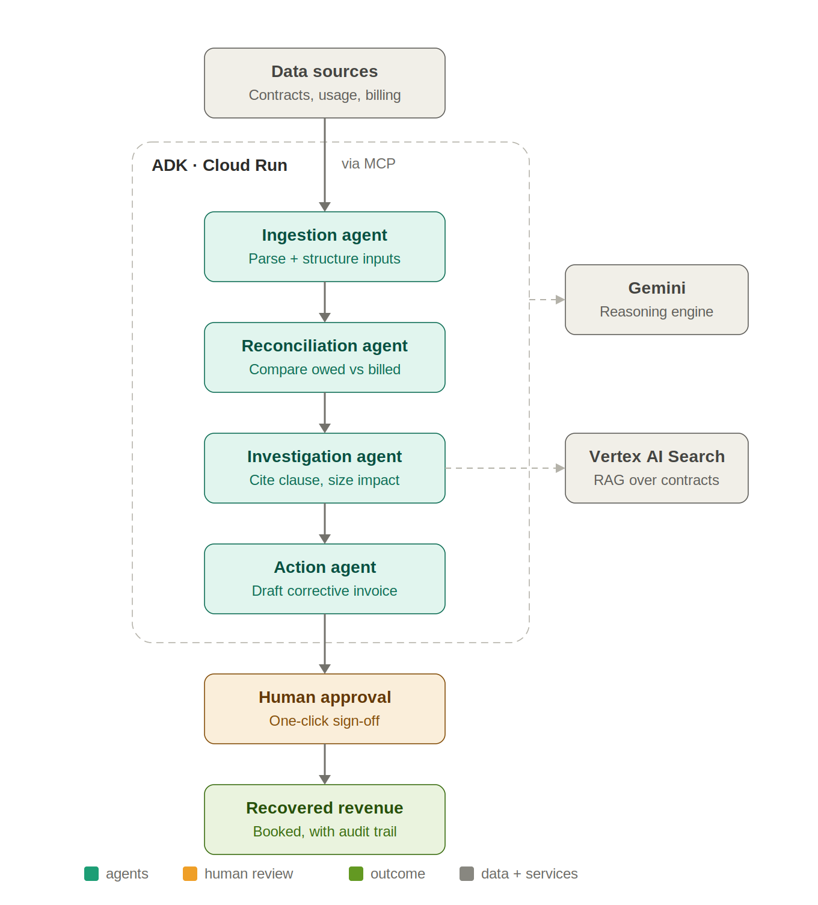

# Recoup

**The revenue you're already owed.** An autonomous, multi-agent system that continuously reconciles what a B2B company *should* be billing against what it *is* billing — and recovers the gap.

## Problem

B2B companies systematically under-bill their own customers. Negotiated contract minimums go unenforced, usage above committed tiers never gets charged, promotional discounts outlive their expiry dates, and annual price escalators written into multi-year deals are forgotten at renewal. This revenue leakage quietly drains an estimated 1–5% of annual recurring revenue — money already earned and contractually owed — for one reason: no human cross-checks every contract against every invoice every month.

## Solution

A multi-agent pipeline orchestrated with the Agent Development Kit:

- **Ingestion agent** — parses contracts and pulls usage and billing records.
- **Reconciliation agent** — compares contractual entitlements against actual charges and flags every discrepancy.
- **Investigation agent** — grounds each flag against the exact contract clause, quantifies the dollar impact, and ranks by recoverable value.
- **Action agent** — drafts the corrective invoice or credit memo and routes it for one-click human approval, with a full audit trail.

## Technologies

Gemini (reasoning and contract-clause extraction) · Agent Development Kit (ADK) for multi-agent orchestration · Vertex AI Search for RAG over the contract corpus · Model Context Protocol (MCP) to connect billing and CRM systems · deployed on Cloud Run. Designed for an Agent-to-Agent (A2A) interoperability layer as the enterprise path.

## Data sources

Customer contracts (PDF/DOCX), usage and metering data, invoice and billing records, and the pricing/rate catalog. This build runs on synthetic-but-realistic data modeled on common SaaS billing structures — no real customer data.

## Challenge

Google for Startups AI Agents Challenge — Track 1 (Build, Net-New Agents) · Region: AMERS.
